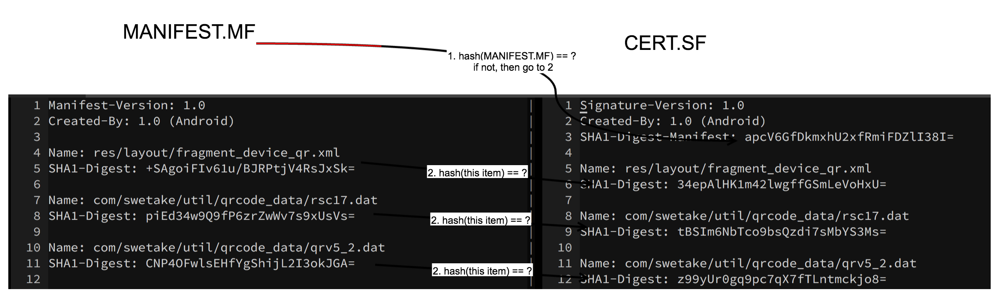
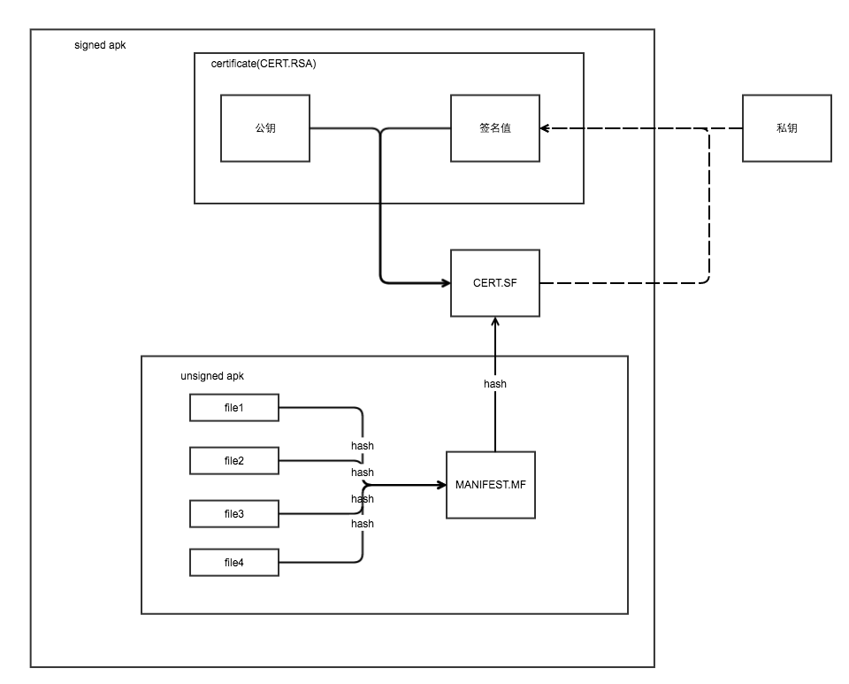

Android apk的签名
===

# apk签名的目的

众所周知，apk需要签名。但是如 https://developer.android.com/guide/topics/security/permissions.html 所说，开发者可以自己给apk签名，并不需要权威机构的认证。因为该签名的作用是用于区分2个apk是否是来自与相同的开发者，而不是用于鉴别是否来自于它所声明的开发者。这2者自然是很不同的，前者要弱很多。
```
All APKs (.apk files) must be signed with a certificate whose private key is held by their developer. This certificate identifies the author of the application. The certificate does not need to be signed by a certificate authority; it is perfectly allowable, and typical, for Android applications to use self-signed certificates. The purpose of certificates in Android is to distinguish application authors. This allows the system to grant or deny applications access to signature-level permissions and to grant or deny an application's request to be given the same Linux identity as another application.
```

也就是说，相同的包，如果你先装了一个假冒开发者签名的apk，那么再装真正开发者签名的apk，是装不上的；而Android系统并不知道第一个装的是假冒的。

# 非对称加密

假设你有2个钥匙，针对任意一个01串，你先用第一个钥匙加密一下，然后用第二个钥匙再加密一下，就可以还原出该01串；如果其中有一个钥匙不对，则很难还原出该01串；也很难根据第一个钥匙推出第二个钥匙是什么。这种东西就叫做非对称加密。典型的用法是，你自己藏好第二个钥匙，同时把第一个钥匙公诸于世界。这第一个钥匙叫做公钥，第二个叫做私钥。

现在比较常用的非对称加密的方法有RSA。

然后当别人拿到一个公钥时，怎么确定这个公钥确实你的公钥？他还需要一个别的，叫做“公钥证书”，该证书用于声明这个公钥是你的。但是怎么确定这个公钥证书也没有被假冒？为此，他还需要一个“证书的证书”。同理，还需要一个“证书的证书的证书”。一直到“证书的证书的...的证书”和世界上某些有公信力的机构的证书内容完全相同为止。

# 用非对称加密来签名和验签

针对任意一个01串，你用公钥或者私钥加密一下，得到一个加密后的值，这一步是为签名，加密后的值称为签名值。然后你把这个01串和签名值一起送给另外一个人，另外一个人把签名值用私钥或者公钥再加密一次，看加密后的值是否和01串一致，这一步是为验签。

为什么要这么做？因为如果你不是亲自把01串送给另外一个人的过程中，就存在中间过程中该01串被篡改的可能。


# Android怎么给apk签名
参考 https://www.ibm.com/developerworks/library/x-androidsecurity/x-androidsecurity-pdf.pdf。
首先要生成一对公钥和私钥，和该公钥的证书（显然该证书是自己生成的，没有公信力的，但在这里没有关系，因为apk的签名不需要公信力）。这一步可以用`keytool`来完成。然后使用`jarsigner`来对apk签名。

`jarsigner`的基本原理参考 http://docs.oracle.com/javase/6/docs/technotes/tools/windows/jarsigner.html。下面通过一个例子重新整理改文的要点。

# 签名后的apk结构
apk实际上是个zip包。在我本地的例子里，一个apk解压缩后，在META-INF文件夹里，会有如下文件：
```
╭─qidu@Happy  /tmp/META-INF
╰─$ l
total 168
drwxr-xr-x@  5 qidu  wheel   170B 10 25 22:41 .
drwxrwxrwt  25 root  wheel   850B 10 25 22:09 ..
-rw-r--r--@  1 qidu  wheel   1.1K 11  3  2014 CERT.RSA
-rw-r--r--@  1 qidu  wheel    38K 11  3  2014 CERT.SF
-rw-r--r--@  1 qidu  wheel    38K 11  3  2014 MANIFEST.MF
``` 
其中CERT.RSA存放了 1)用私钥对CERT.SF进行加密后得到的签名值和2)对应的公钥和公钥证书，CERT.SF存放MANIFEST.MF的hash值，MANIFEST.MF存放apk中其他文件的hash值。

其中CERT.SF内容大致这个样子：
```
Signature-Version: 1.0
Created-By: 1.0 (Android)
SHA1-Digest-Manifest: apcV6GfDkmxhU2xfRmiFDZlI38I=

Name: res/layout/fragment_device_qr.xml
SHA1-Digest: 34epAlHK1m42lwgffGSmLeVoHxU=
```

而MANIFEST.MF内容大致这样子：
```
Manifest-Version: 1.0
Created-By: 1.0 (Android)

Name: res/layout/fragment_device_qr.xml
SHA1-Digest: +SAgoiFIv61u/BJRPtjV4RsJxSk=
```


# 怎么检验apk的签名

1. 先用CERT.RSA里的公钥对CERT.RSA里的签名值进行再次加密，看是否匹配CERT.SF的内容（参见验签一节）。如果成功，就证明CERT.SF内容确实是`jarsigner`签名时候的值。
2. 在上面一步成功的前提下，对MANIFEST.MF做Hash（上面这个例子里是做SHA1），看是否匹配CERT.SF里的内容。这一步比较有趣：见  

# 总图

 
